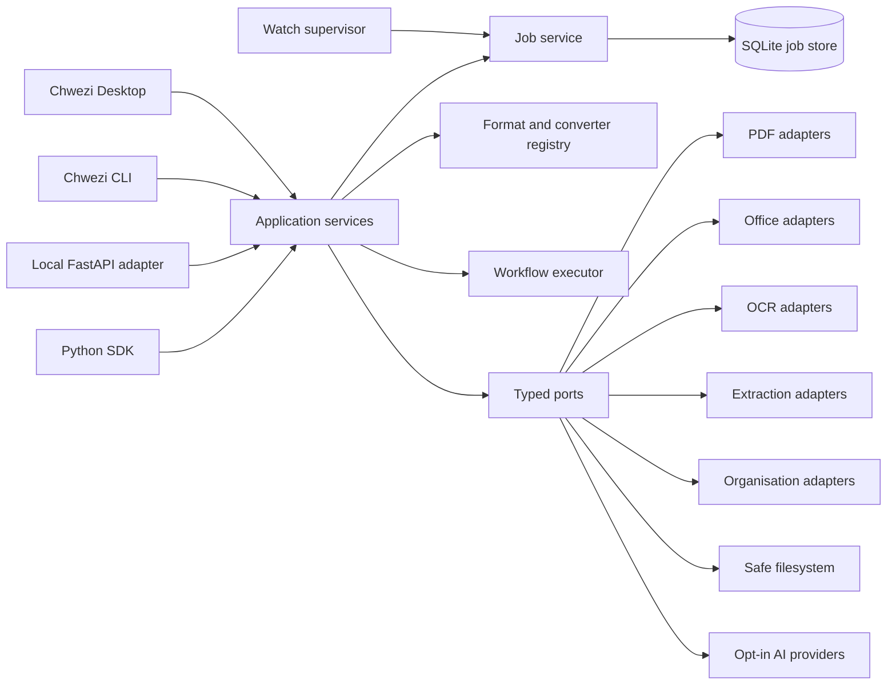

# Target Architecture

Status: proposed  
Decision owner: project maintainer  
Architecture style: local-first modular monolith with process-isolated workers

## Product boundary

Chwezi Document Suite is one local document-processing engine exposed through a Python SDK, `chwezi` CLI, PySide6 desktop shell, local FastAPI adapter and watch-folder supervisor. Server multi-tenancy, team accounts and cloud storage are outside the first public release.

Core invariants:

- an input is never overwritten unless a request explicitly selects overwrite;
- all outputs are created in a job-specific staging directory, validated, then atomically promoted when the filesystem permits;
- every externally supplied path is resolved and checked against an authorised root;
- converter claims come from a registry and capability probe, not documentation prose;
- optional remote AI receives no document content without explicit per-provider and per-workflow consent;
- interfaces call application services; they do not implement document algorithms.

## Component view



## Package boundaries

| Boundary | Owns | Must not own |
|---|---|---|
| `domain` | formats, requests, results, errors, jobs, events | filesystem or framework imports |
| `application` | use-case orchestration, policies, result aggregation | PDF parsing algorithms or UI state |
| `conversion` | converter contract, registry, route planning, validation | CLI/web presentation |
| `pdf`, `extraction`, `organisation`, `workflows` | capability-specific pure logic and ports | global config or direct user prompting |
| `infrastructure` | filesystem, subprocess, SQLite, office, OCR and AI adapters | user-facing workflows |
| `interfaces` | input parsing, progress presentation, result serialisation | duplicate conversion or move logic |

The initial source layout follows `src/chwezi_docs/`. Modules are added only when an implemented capability needs them; empty scaffolding is avoided.

## Critical flows

| Flow | Happy path | Failure controls | Operator action |
|---|---|---|---|
| Convert | detect, plan, stage, convert, validate, promote | size limits, capability check, cancellation, collision policy, cleanup | install missing extra, change route, inspect warnings |
| PDF mutation | open copy, apply page plan, validate page count, promote | encrypted/corrupt detection, selected-page validation, atomic output | supply password, correct ranges, retain original |
| Organise | inspect, classify, preview, approve, transactional move | safe templates, containment check, collision policy, undo manifest | approve, edit destination, undo |
| Watch | stabilise, fingerprint, enqueue, execute, route result | debounce, restart recovery, retry cap, success/failure folders | retry, quarantine or correct workflow |
| Local web | random upload ID, isolated job directory, submit job, authorised download | localhost bind, retention, non-guessable IDs, path containment | clear job data or export diagnostics |

## Conversion contract

Each converter declares source and target formats, requirements, fidelity, cost rank, cancellation behaviour and validation rules. The planner uses a directed graph and rejects cycles. Path ranking is deterministic: available capability, fewer lossy steps, higher fidelity, fewer external processes, then fewer steps.

```text
ConversionRequest -> planner -> ConversionPlan -> staged converter steps
                  -> validators -> ConversionResult + warnings + manifest
```

The structured document representation is introduced during Phase 2 only after a schema ADR and golden corpus. PDF page-editing stays outside that representation.

## Job execution

SQLite persists job metadata and audit events, not extracted document contents. Long operations execute outside GUI and HTTP event loops. Phase 1 may use a bounded `ProcessPoolExecutor`; a queue service is deferred until server deployment is justified.

Job transitions are validated:

```text
QUEUED -> PREPARING -> RUNNING -> COMPLETED | COMPLETED_WITH_WARNINGS | FAILED
                           \-> CANCELLING -> CANCELLED
Interrupted processes become INTERRUPTED during startup recovery.
```

## Adapter and trust boundaries

- Filesystem adapter: authorised roots, symlink policy, safe staging, atomic replace and cleanup.
- Archive adapter: entry-count, expanded-size, path and compression-ratio limits before OOXML/EPUB reads.
- Subprocess adapter: absolute executable resolution, argument arrays, `shell=False`, timeout, cancellation and captured version.
- AI adapter: local classifier default; remote providers disabled until consent and data-minimisation options are present.
- Web adapter: localhost only in initial release; uploaded files isolated by random job ID.

## Error strategy

All public errors derive from `ChweziError` and carry a stable code, safe message, technical detail, suggested action, retryability and optional cause. Interfaces translate the same error into human text, JSON or GUI state. Stack traces remain in sanitised diagnostic logs.

## Configuration strategy

Precedence is defaults, system, user, project, environment and explicit request/CLI. Configuration uses typed models and `platformdirs`; normal execution never writes into the checkout. Secrets are references to environment variables or OS keyring entries, not values in project files or browser cookies.

## Technology decisions

| Concern | Proposed choice | Reason and constraint |
|---|---|---|
| Runtime | Python 3.11 minimum, 3.12 primary | Current OCRmyPDF requires 3.11+; 3.12 has broad wheel support |
| Packaging | Hatchling, PEP 621 | Small build surface and clean `src` packaging |
| CLI | Typer | Typed command composition and Click-compatible testing |
| Desktop | PySide6 | Mature Qt model/view, accessibility hooks and worker integration; LGPL obligations must be documented |
| Local web | FastAPI | Typed boundary, OpenAPI and async job-status endpoints; processing remains in workers |
| Persistence | SQLite | Local, transactional, cross-platform and sufficient for job metadata |
| PDF base | pypdf plus pikepdf adapters | Permissive/MPL options for structural work; capability-specific selection |
| Rendering | optional PyMuPDF or another renderer | Performance is attractive, but AGPL/commercial terms require an explicit distribution decision |
| OCR | OCRmyPDF adapter with Tesseract | Existing safety modes and searchable-PDF workflow; system dependencies remain optional |
| Signing | pyHanko | Mature PDF signing/validation rather than custom cryptography |
| Office | LibreOffice headless first, Word COM optional on Windows | Offline cross-platform baseline with honest fidelity reporting |
| Rich conversion | optional Pandoc, Calibre and Docling adapters | Avoid forcing large dependencies into core |

## Deployment shape

P0 is a modular monolith installed as a Python package. Desktop bundles embed the package and spawn bounded local workers. The local web profile binds `127.0.0.1`; no production server claim is made. Container and authenticated worker deployments require a later ADR, threat-model update and isolation tests.

## Fitness checks

- Every CLI/API operation imports application services rather than legacy script algorithms.
- A path traversal corpus cannot create files outside the authorised output root.
- Killing a worker leaves the input unchanged and marks the job interrupted on restart.
- Capability output changes when an optional executable/module is added or removed.
- A conversion failure leaves no final zero-byte output and cleans its staging directory.
- Core installation starts and reports capabilities without desktop, OCR, office or cloud SDK extras.

